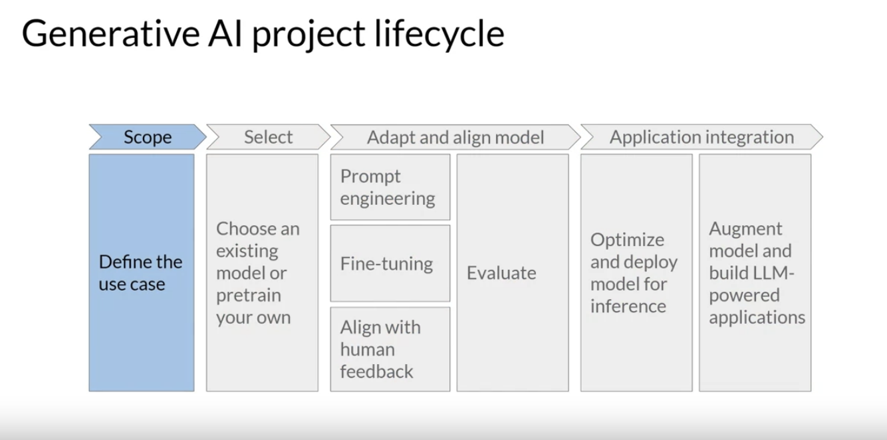
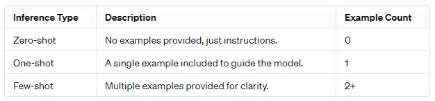
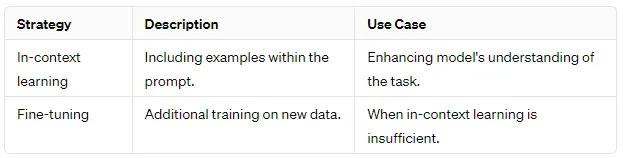
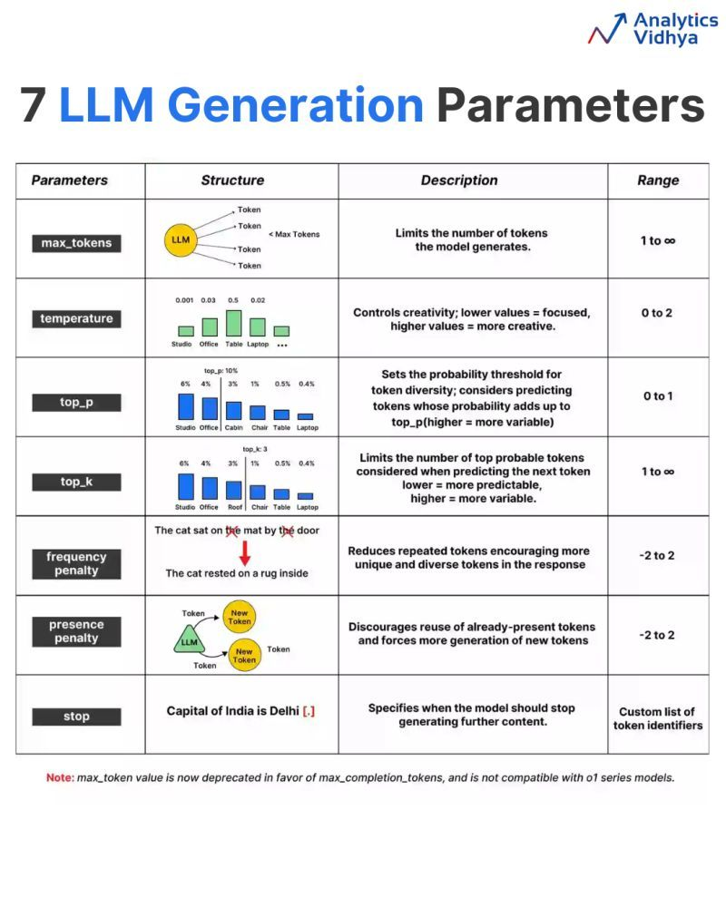
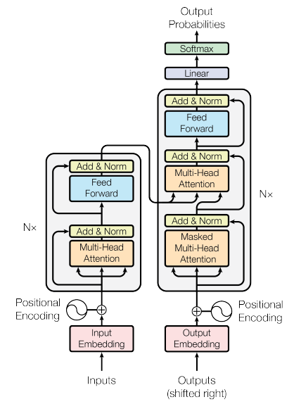

# Generative AI

Generative AI is a type of AI that can create new content, such as text, images, music, audio, and videos. It's powered by large AI models, called foundation models, that can perform a variety of tasks, including summarization, Q&A, and classification.

---

**Generative AI Project Lifecycle:**

**<u>Key Concepts in Language Model Interaction:</u>**
- **Prompt:** The input text provided to the model.
- **Inference:** The process of generating text based on the prompt.
- **Completion:** The output text produced by the model.

---

## Prompt Engineering:
Prompt engineering is a critical aspect of working with language models (LMs), such as GPT (Generative Pre-trained Transformer). It involves crafting the input text (the prompt) in a way that effectively guides the Language Models towards generating the desired output (the completion). This process can sometimes require multiple iterations of refinement to achieve the best results, a practice known as prompt engineering.

**<u>Context Window:</u>**

The context window refers to the total amount of text that the model can consider at one time. It is a critical factor since it limits the amount of information that can be used for generating responses.

---

**<u>In-context learning:**</u>

In-context learning is a powerful technique where examples or additional data are included within the prompt to help the model understand and perform the task better. It can significantly enhance the model’s ability to generate appropriate and accurate completions.

**<u>Zero-Shot vs. One-Shot vs. Few-Shot Inference:**</u>

- **Zero-shot inference:** Providing the model with no specific examples, just instructions.
- **One-shot inference:** Including a single example within the prompt to guide the model.
- **Few-shot inference:** Incorporating multiple examples to better demonstrate the desired output.

  

**<u>Effectiveness Across Model Sizes:**</u>

- **Larger models:** Typically excel at zero-shot inference, understanding tasks with little to no examples.
- **Smaller models:** May struggle with zero-shot inference but improve significantly with one-shot or few-shot examples.  

**<u>Limitations and Fine-Tuning:**</u>

While in-context learning is powerful, it’s important to ***remember the context window limitation.*** If including multiple examples does not improve model performance, fine-tuning the model with additional training on new data may be a more effective approach.

----

**LLM Parameters:**

## Computational Challenges of Training LLMs and Their Resolutions

Training large language models (LLMs) presents several computational challenges:

### 1. Data Requirements
- **Challenge**: LLMs require vast amounts of diverse training data to perform well, which can be difficult to obtain and manage.
- **Resolution**: Implement data augmentation techniques, use transfer learning from smaller models, and leverage synthetic data generation.

### 2. Computational Resources
- **Challenge**: Training LLMs demands substantial computational power, often necessitating specialized hardware like GPUs or TPUs.
- **Resolution**: Utilize distributed training across multiple machines, optimize model architectures for efficiency (e.g., model pruning, quantization), and consider cloud-based solutions to scale resources dynamically.

### 3. Memory Limitations
- **Challenge**: LLMs can exceed the memory capacity of available hardware, particularly during training.
- **Resolution**: Use gradient checkpointing to save memory during backpropagation, implement mixed precision training to reduce memory footprint, and adopt model parallelism to distribute memory load.

### 4. Training Time
- **Challenge**: Training can take an extensive amount of time, making iteration on model designs and hyperparameters slow.
- **Resolution**: Optimize training algorithms (e.g., using AdamW optimizers), employ early stopping based on validation performance, and implement techniques like learning rate scheduling to accelerate convergence.

### 5. Hyperparameter Tuning
- **Challenge**: Finding the optimal hyperparameters for LLM training is complex and resource-intensive.
- **Resolution**: Use automated hyperparameter optimization tools, such as Bayesian optimization or grid search, to efficiently explore the hyperparameter space.

### 6. Overfitting
- **Challenge**: LLMs may overfit the training data, particularly with limited data diversity.
- **Resolution**: Incorporate regularization techniques, such as dropout, weight decay, and data augmentation, to improve generalization.

### 7. Ethical and Bias Concerns
- **Challenge**: LLMs can inadvertently learn biases present in the training data, leading to ethical concerns.
- **Resolution**: Curate training datasets carefully, implement bias detection and mitigation techniques, and involve diverse perspectives in model development and evaluation.

### 8. Scalability
- **Challenge**: As models scale, the complexity and difficulty of managing training pipelines increase.
- **Resolution**: Use orchestration tools (like Kubernetes) for managing distributed training jobs, adopt containerization for reproducibility, and streamline data pipelines to facilitate scalability.

By addressing these challenges with targeted strategies, developers can improve the efficiency and effectiveness of training large language models.

----

## Transformers

The Transformer model uses self-attention to compute representations of input sequences, which allows it to capture long-term dependencies and parallelize computation effectively.

The Transformer architecture consists of an encoder and a decoder, each of which is composed of several layers. Each layer consists of two sub-layers: a multi-head self-attention mechanism and a feed-forward neural network. The multi-head self-attention mechanism allows the model to attend to different parts of the input sequence, while the feed-forward network applies a point-wise fully connected layer to each position separately and identically. 

The Transformer model also uses residual connections and layer normalization to facilitate training and prevent overfitting. In addition, the authors introduce a positional encoding scheme that encodes the position of each token in the input sequence, enabling the model to capture the order of the sequence without the need for recurrent or convolutional operations.

---